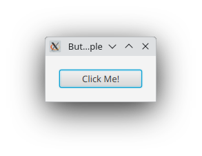

# javafx_button_exercise

A simple exercise in trying to understand the sequence of events generated by a JavaFX button.

I posted the question

[JavaFX events sent to a button control: why two MOUSE_ENTERED / MOUSE_EXITED events?](https://stackoverflow.com/questions/79059318/javafx-events-sent-to-a-button-control-why-two-mouse-entered-mouse-exited-eve/)

to Stack Overflow, and after clarification, we get the code and diagrams in this project.

The program creates a [Button Control](https://openjfx.io/javadoc/23/javafx.controls/javafx/scene/control/Button.html) which you can prod. 

Information about events generated by the Button Control (aka. "received at the Button Control's event handlers) is then printed out.

See the [`MouseEvent` JavaDoc](https://openjfx.io/javadoc/23/javafx.graphics/javafx/scene/input/MouseEvent.html) for a description of events.

After testing a bit, we obtain the following (not quite formally correct) [statechart](https://en.wikipedia.org/wiki/UML_state_machine)
that describes what events are generated. The statechart is large-ish because the sequence of event generated depends on where exactly
the mouse button was pressed - outside the Button Control, inside the Button Control or inside the Button Control's label. 
(But there may well be a simpler statechart.)

The above has been edited in yEd, which has no notion about statechart semantics. The result is a [graphml file](doc/Button%20state%20machine.graphml).
